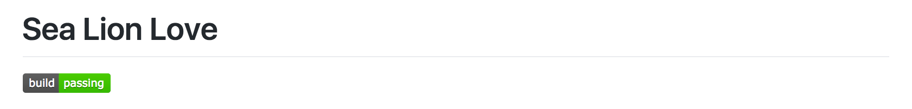
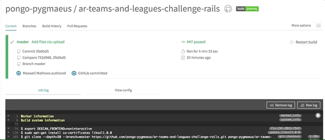

<h1> TDD and CI Love </h1>

**HTML BADGE** </img><br>
**MARKDOWN BADGE** [](https://travis-ci.org/pongo-pygmaeus/ar-teams-and-leagues-challenge-rails)

Wooo! Check out this Rails implementation of the really fun Teams/Leagues/Memberships AR challenge with most MVC tests implemented. (For more info about using this repo and continuous integration (CI) see the document [here](./resources/ci_with_travis.pdf)). 

## WHY?

To demonstrate the beauty and ease of CI. 

## INSTRUCTIONS

* Install Rails 5
* Run `bundle` inside the directory
* Run `rails db:seed RAILS_ENV=test; rails spec` to perform tests (lots of `*_controller` and `*_helper` tests are currently pending)
* Run `rails db:seed` to seed development database
* Run `rails s` to start Rails server on `localhost`
* Open your browser and navigate to `localhost:3000`
* Explore!
* Run Travis CI

Travis Annotations (Everything below is run in a dynamic Docker container every time Travis CI runs a test suite)

Start Postgres:
```
services:
- postgresql
```
Declare which programming languages are have tests against them and which versions of the programming language to test against.
```
language: ruby
rvm:
- 2.3.1
```

Declare any environment settings required to run tests
```
env:
- DB=postgresql
```

Set up the test database
```
before_script:
- psql -c 'create database ar_teams_and_leagues_challenge_rails_test;' -U postgres
```

Set up the test environment, seed test database, run tests
```
script:
- RAILS_ENV=test bundle exec rake db:migrate --trace
- bundle exec rake db:test:prepare
- bundle exec rake db:seed RAILS_ENV=test
- bundle exec rspec spec/
```

Use Heroku account information to deploy to that service (Set up your app on Heroku like you normally would prior
to filling in these fields)

To get the `api_key` field, run `travis encrypt $(heroku auth:token) --add deploy.api_key` in your local project directory. Also, you may need to run `gem install travis` before running the previous command if you do not have the Travis CI command line tools installed. 
```
deploy:
  provider: heroku
  app: frightening-moonlight-10587
  api_key:
    secure: Lxa...
```

How did we get this build badge to show up in this repo?



Pretty easily actually. After a build completes and Travis runs your program's test suite, Travis knows the status of your program's test results (Passing/Failing). If you navigate to your project's Travis test page, you'll see a status image at the top right of the page. Click this image to get a modal popup: 



Copy the `svg` image name in the bottom text field of the modal popup (you can use either the values from `Image URL` or `Markdown` dropdown selections in your GitHub readme.md). After you've copied the image name, pop it into your `readme.md` in an `` tag or as some markdown. (Look at the beginning of this readme to see what I'm talking about).

## CIRCLE CI INSTRUCTIONS FOR THOSE WHO CARE

To build and deploy your project with CircleCI:

1. Add a file to the root directory of your project called `circle.yml` (no leading period).
2. Log into GitHub then visit https://circleci.com
3. Navigate to https://circleci.com/add-projects
4. Locate your the project you want to build and select `Build Project`
5. Go to https://dashboard.heroku.com/account, and copy the API key located towards the bottom of the page.
6. Go to the CircleCI dashboard: https://circleci.com/dashboard.
7. Click on the gear icon to the right of a project name to access project settings.
8. Scroll down to `Heroku Deployment`
9. In the area titled `Step 1`, enter the Heroku API key retrieved in step 1 of this procedure.
10. In the area titled `Step 2`, click the `Set user to <GitHub username>` button.

Example `circle.yml`

```
database:
  override:
    - bundle exec rake db:create
    - bundle exec rake db:migrate
    - bundle exec rake db:seed
deployment:
  staging:
    branch: master
    heroku:
      appname: <Heroku App Name>
```

